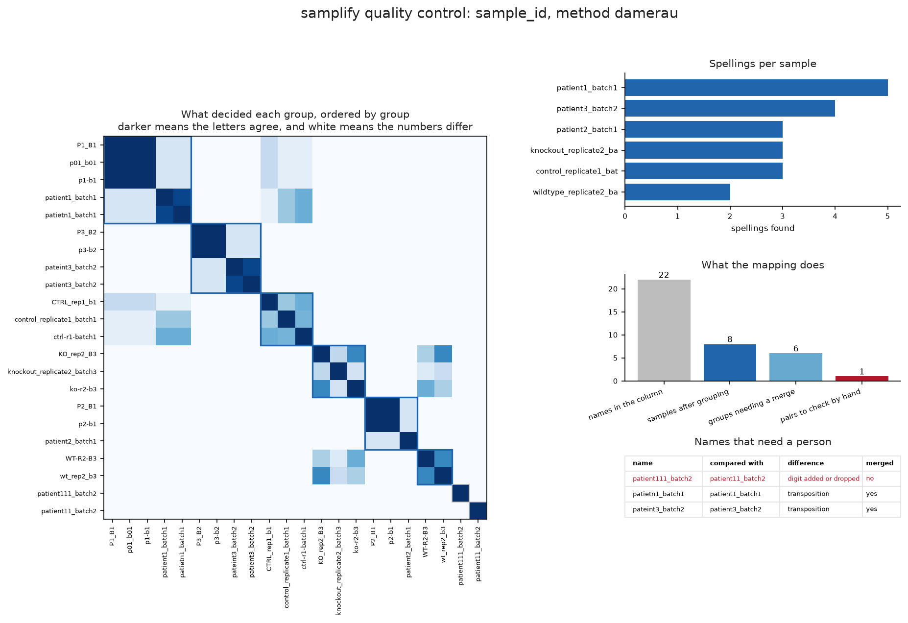
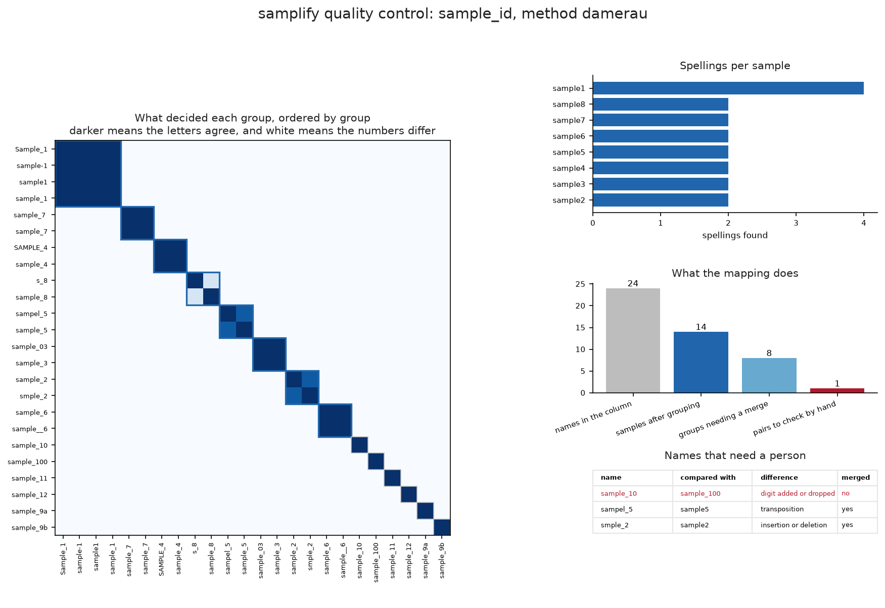
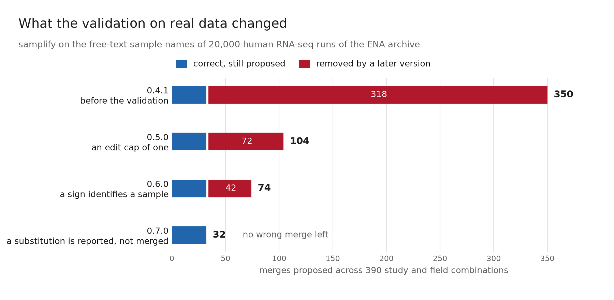

# samplify

[](https://github.com/wguesdon/samplify/actions/workflows/ci.yml)

samplify finds the sample names in a CSV column that are one sample with several
spellings. It proposes one canonical name for each group, and you confirm each
group before samplify changes a name.

```
S1_B1            ─┐
s1-b1            ─┤
s01_b01          ─┼─►  patient1_batch1     you confirm this group
patient1_batch1  ─┤
patietn1_batch1  ─┘

patient11_batch1  ──►  reported, not merged
patient111_batch1 ──►  a typing error, or two patients
```

An inconsistent sample identifier breaks a table join, and the join reports no
error. The row count drops and the counts disagree, but no message names the
cause.

samplify never merges two names with different numbers, because the numbers
identify the sample. Six backends form the groups, and four of them make no
network call. The default backend is `auto`, and it calls a model only when the
offline pass finds an inconsistency or forms a cluster. That model is a hosted
one through OpenRouter, or a local one through ollama.

## Install

```bash
uv add git+https://github.com/wguesdon/samplify
```

The offline backends need no other package. To draw the quality control figure,
install the `plot` extra. The extra adds matplotlib.

```bash
uv add "samplify[plot]"
```

The `llm` and `auto` backends need a model, and two services answer. The first
is [OpenRouter](https://openrouter.ai), which reads its key from a `.env` file.

```env
OPENROUTER_API_KEY=sk-or-v1-...
OPENROUTER_MODEL=openai/gpt-4o-mini
```

## A local model with ollama

The second service is [ollama](https://ollama.com), which runs the model on your
own machine. It needs no key, and the sample names never leave the machine.

```bash
ollama pull qwen3.5:9b
uv run samplify propose data.csv -c sample_id -M auto --provider ollama
```

The option `--model` chooses another model. The option `--base-url` and the
variable `OLLAMA_HOST` point at another machine. A local model on a CPU is
slower than a hosted one, so `--timeout` sets how long samplify waits, and the
default is 300 seconds.

The mapping file records the service that answered, so a file written this way
holds `"provider": "ollama"`.

## Example

The commands below clone the repository and prepare the environment. The example
uses the `damerau` backend, so it runs offline and needs no key.

```bash
git clone https://github.com/wguesdon/samplify.git
cd samplify
uv sync
```

samplify separates the proposal, the decision and the change. Each step writes a
file, so the record shows which step a person checked.

### 1. Propose

```bash
uv run samplify propose example/cohort_messy.csv -c sample_id -M damerau -o mapping.json
```

The command prints the diagnosis, the near misses and the candidate groups, and
it writes `mapping.json`. Every group starts with the status `proposed`.

```
8 groups: 6 merge, 0 rename, 2 unchanged, 1 near miss.
```

### 2. Review

```bash
uv run samplify review mapping.json
```

The command shows one group at a time and asks for a decision. You have three
options for each group.

- Accept the proposed name.
- Reject the group, so every member keeps its original name.
- Type a different canonical name.

The groups that merge two or more names come first, because they carry the risk.
The command needs a terminal.

### 3. Apply

```bash
uv run samplify apply mapping.json --output clean.csv --csv-log changes.csv
```

The command makes no model call. The same mapping file and the same input give
the same output on any machine and on any day. samplify does not change the
original column, and a new column with the name `sample_id_canonical` holds the
result.

A pipeline can accept every proposal at the propose step with `--yes`. The
mapping file then records `"reviewed": false`, and `apply` prints that value.

## The quality control figure

```bash
uv run samplify propose example/cohort_messy.csv -c sample_id -M damerau \
  -o mapping.json --plot qc.png
```



Four panels answer the questions that a person asks before a review. samplify
orders the similarity matrix on the left by group, so a block on the diagonal is
one sample. The outline around a block shows the names that samplify proposes to
merge, and the pair in red stays apart.

The matrix holds the value that decided each group. A dark cell means the
letters of the two names agree. A white cell means the numbers differ, so
samplify never compared the pair, and the near-miss pair in the bottom corner
reads white for that reason.

The three panels on the right give the spellings per sample and the counts before
and after the change. The last panel lists the names that need a decision and the
reason for each name.

samplify draws the figure from the mapping file. The command
`samplify plot mapping.json -o qc.png` draws it again at any time, and it also
works after the review.

The file `example/mislabel_catalogue.csv` is the reference set. Each of its rows
names its own fault and records the correct sample in a `true_sample` column, so
a test checks the answer and no person reads the output. Twenty-four written
names cover fourteen real samples.

```bash
uv run samplify propose example/mislabel_catalogue.csv -c sample_id -M damerau \
  -o mapping.json --plot qc.png
```



The blocks on the diagonal are the fourteen samples. The pair `sample_10` and
`sample_100` is the one that samplify refuses to merge, and the last panel gives
the reason for that pair and for each name that samplify did merge.

## Validation on real data

samplify was measured against the free-text sample names of 20,000 human
RNA-seq runs of the [ENA archive](https://www.ebi.ac.uk/ena/browser/home). The
names in `library_name` and `sample_title` are typed by the submitting lab,
which is the input this tool is written for. 390 study and field combinations
hold between 8 and 200 unique names.



The run found three faults, and each one merged two different samples with no
message. A ratio scales with the length of a name, so a long shared context hid
a short difference: `EVT-TS-1_paired-RNA` and `ST-TS-1_paired-RNA` are two cell
types. Normalisation deleted a sign that identifies a sample, so `OVTOKO_DOX+`
and `OVTOKO_DOX-` became one string. A substituted letter merged
`Primary B cells` with `Primary T cells`.

Version 0.7.0 proposes 32 merges on that corpus. Each of the 32 was read by
hand and each is correct. Of the merges that later versions removed, all 30 of
the sign class and all 42 of the substitution class were read, and a sample of
the 246 that the edit cap removed. Every one of them joined two different
samples.

The script `docs/make_validation_figure.py` redraws the figure, and
[docs/how_it_works.md](docs/how_it_works.md) gives the rule that each version
added.

## Documentation

- [docs/how_it_works.md](docs/how_it_works.md) explains the backends, the mapping
  file, the match rules and the design rules.
- [example/README.md](example/README.md) explains each example file and gives the
  command that runs it.
- [CHANGELOG.md](CHANGELOG.md) records the changes in each version.

## License

The license is MIT. See [LICENSE](LICENSE).
